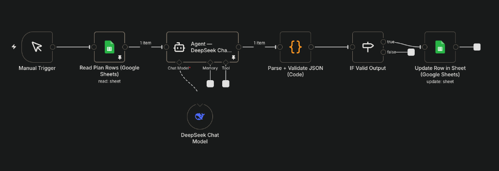

# Day 04: Why Early Devs Lose to Automation

## Output
- **Blog Post**: [Why Early Developers Lose to Automation](https://blog.avnishyadav.com/2026/01/why-early-developers-lose-to-automation.html)
- **LinkedIn**: [Post](https://www.linkedin.com/posts/avnishyadav25_developers-automation-n8n-activity-7414157712055365632-UyHD)
- **n8n Workflow**: [Content Generator Workflow](./content-generator-workflow.json)

## TL;DR
Early devs believe automation is "advanced" or "later-stage." That belief is wrong. Automation is not about replacing skills — it's about amplifying learning speed. Two devs with the same skills diverge: one repeats tasks manually, the other automates them once and reuses forever.

## Core Lesson: Automation is Leverage, Not Shortcuts

### The Myth
Most beginners think:
- "I need to learn the basics first"
- "Automation is for seniors"
- "I should do things manually to understand them"

### The Reality
Automation is a **career multiplier**, not a productivity hack. It's about:
1. **Compounding effort** - Build once, use forever
2. **Reducing cognitive load** - Stop remembering, start executing
3. **Accelerating learning** - Automate the boring parts, focus on the hard parts

### The Workflow
The attached n8n workflow (`content-generator-workflow.json`) demonstrates this principle:
- **Input**: A Google Sheet with your content plan (Day, Topic, Pillar, Description)
- **Process**: DeepSeek AI generates platform-specific content (Instagram, Blog, LinkedIn)
- **Output**: Multi-platform content written back to the sheet

### Why This Matters for Early Devs
Instead of spending 2 hours writing content for each platform, you:
1. Define your plan once
2. Let the system generate drafts
3. Edit and publish

This is **leverage**. The same amount of effort produces 3x the output.

## Deliverables
- [x] Content Generator n8n Workflow ([workflow](./content-generator-workflow.json))
- [x] Content Generator Prompt ([prompt](./content-generator-prompt.md))
- [x] Google Sheet Template
- [ ] Blog Post Published
